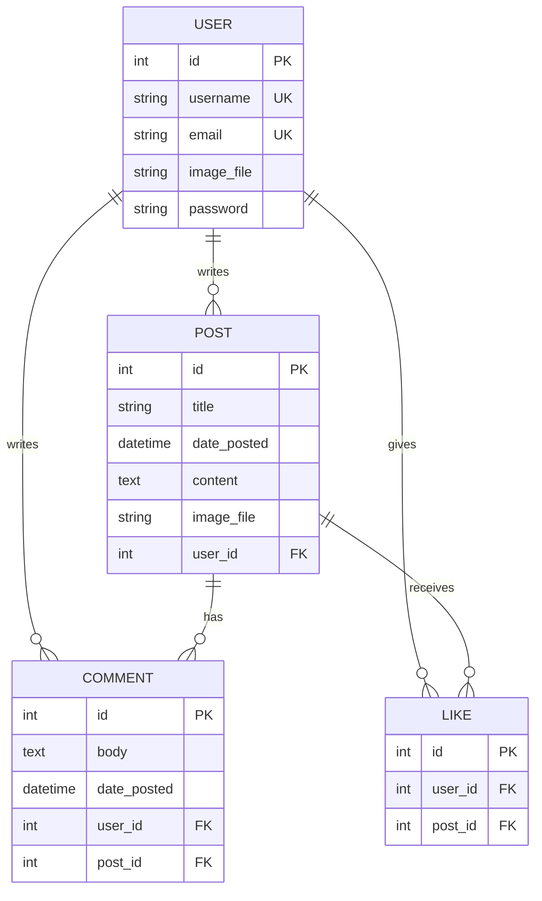

<div align="center">

# ✦ BLOGIFY ✦

### A Modern Blogging Platform — Where Good Writing Finds Its Readers

[](https://python.org)
[](https://flask.palletsprojects.com)
[](https://www.sqlalchemy.org)
[](LICENSE)
[](https://blogify-jitt.onrender.com)

<br>

> *A robust, full-featured content management and blogging web application built with Python & Flask.*
> *Featuring a premium glassmorphic dark-theme UI, secure authentication, and a seamless writing experience.*

<br>

[🌐 Live Demo](https://blogify-jitt.onrender.com) · [🐛 Report Bug](https://github.com/prasenjitshinde27-byte/BLOGIFY/issues) · [💡 Request Feature](https://github.com/prasenjitshinde27-byte/BLOGIFY/issues)

---

</div>

<br>

## 📋 Table of Contents

- [About The Project](#-about-the-project)
- [Key Features](#-key-features)
- [Technology Stack](#-technology-stack)
- [Architecture](#-architecture)
- [Getting Started](#-getting-started)
- [Environment Variables](#-environment-variables)
- [Project Structure](#-project-structure)
- [Database Models](#-database-models)
- [API Routes](#-api-routes)
- [Deployment](#-deployment)
- [Contributing](#-contributing)
- [License](#-license)
- [Contact](#-contact)

<br>

## 🎯 About The Project

**Blogify** is a polished, production-ready blogging platform designed for content creators and readers alike. It combines secure authentication, profile management, post publishing, commenting, and a modern dark-themed interface — all in a single, elegant web application.

Visitors are greeted with a **stunning animated welcome page** featuring floating orbs, a quote carousel, live platform stats, and a dark/light theme toggle — before being guided to sign up or log in.

The UI features a **premium glassmorphic design** with:
- 🌑 Deep navy-charcoal dark theme (`#0a0e1a`) with light mode toggle
- 🔮 Frosted-glass card effects with backdrop blur
- 🎨 Vibrant cyan-to-violet gradient accents
- ✨ Smooth micro-animations, floating orbs, and hover transitions
- 🎯 Centered auth pages — clean, focused, no distractions
- 📱 Fully responsive layout for all screen sizes

<br>

## ✨ Key Features

<table>
<tr>
<td width="50%">

### 🔐 Authentication & Security
- Secure registration & login with password hashing
- Session management via Flask-Login
- CSRF protection on all forms
- Password reset via email with JWT tokens

</td>
<td width="50%">

### ✍️ Content Management
- Create, edit, and delete blog posts
- Rich text content with post images
- Paginated feed with chronological sorting
- Per-user post filtering & profile pages

</td>
</tr>
<tr>
<td width="50%">

### 💬 Social & Engagement
- Comment system on every post
- ❤️ **Like / Unlike posts** with real-time AJAX (no page reload)
- Per-post like counts & comment counts on every card
- Author profiles with avatar images
- 🔍 **Full-text search** — search posts by title or content

</td>
<td width="50%">

### 👤 Profile & Account
- Custom avatar uploads with auto-resize (Pillow)
- Username & email updates
- Secure account deletion
- Old profile picture cleanup

</td>
</tr>
<tr>
<td width="50%">

### 📧 Email Integration
- Password reset emails via SMTP (Gmail or Mailtrap)
- Timed token-based verification links (30 min expiry)
- Mailtrap sandbox for safe local dev testing
- Graceful error handling — friendly flash instead of 500 crash

</td>
<td width="50%">

### 🚀 Production Ready
- Application factory pattern
- Blueprint-based modular architecture
- Database migrations with Flask-Migrate
- Render / Heroku deployment support

</td>
</tr>
</table>

<br>

## 🛠️ Technology Stack

<div align="center">

| Layer | Technologies |
|:---:|:---|
| **Backend** | Python 3.10+ · Flask 3.0 · Gunicorn |
| **Database** | Flask-SQLAlchemy · SQLite (dev) · PostgreSQL (prod) · Flask-Migrate |
| **Auth** | Flask-Login · Flask-Bcrypt · Flask-WTF · itsdangerous |
| **Mail** | Flask-Mail · Gmail SMTP · Mailtrap (dev sandbox) |
| **Frontend** | Jinja2 · HTML5 · CSS3 (Glassmorphism) · Tabler Icons · Inter Font |
| **Imaging** | Pillow (avatar resizing) |
| **Deployment** | Render · Gunicorn · python-dotenv |

</div>

<br>

## 🏗️ Architecture

Blogify follows the **Application Factory** pattern with **Flask Blueprints** for clean separation of concerns:

```
┌─────────────────────────────────────────────────────────────┐
│                        Client (Browser)                     │
└──────────────────────────┬──────────────────────────────────┘
                           │
┌──────────────────────────▼──────────────────────────────────┐
│                     Flask Application                       │
│                    (create_app factory)                      │
│                                                             │
│  ┌─────────┐  ┌─────────┐  ┌─────────┐  ┌──────────────┐  │
│  │  Main   │  │  Users  │  │  Posts  │  │    Errors     │  │
│  │Blueprint│  │Blueprint│  │Blueprint│  │  Blueprint    │  │
│  │         │  │         │  │         │  │              │  │
│  │ • Welcm │  │ • Login │  │ • CRUD  │  │ • 403 / 404 │  │
│  │ • Home  │  │ • Reg.  │  │ • View  │  │ • 500       │  │
│  │ • About │  │ • Reset │  │ • Like  │  │              │  │
│  │         │  │ • Acct. │  │ • Cmnt. │  │              │  │
│  └─────────┘  └─────────┘  └─────────┘  └──────────────┘  │
│                           │                                 │
│              ┌────────────▼────────────┐                    │
│              │   SQLAlchemy ORM + DB   │                    │
│              │  (SQLite / PostgreSQL)  │                    │
│              └─────────────────────────┘                    │
└─────────────────────────────────────────────────────────────┘
```

<br>

## 🚀 Getting Started

### Prerequisites

- **Python 3.10+** installed on your system
- **pip** (Python package manager)
- **Git** for cloning the repository

### Installation

**1. Clone the repository**

```bash
git clone https://github.com/prasenjitshinde27-byte/BLOGIFY.git
cd BLOGIFY
```

**2. Create & activate a virtual environment**

```bash
python -m venv venv
```

<table>
<tr>
<td> <b>Windows</b> </td>
<td> <b>macOS / Linux</b> </td>
</tr>
<tr>
<td>

```bash
venv\Scripts\activate
```

</td>
<td>

```bash
source venv/bin/activate
```

</td>
</tr>
</table>

**3. Install dependencies**

```bash
pip install -r requirements.txt
```

**4. Set up environment variables**

Create a `.env` file in the project root:

```env
SECRET_KEY=your_super_secret_key_here

# For local development — use Mailtrap (free at mailtrap.io)
MAIL_SERVER=sandbox.smtp.mailtrap.io
MAIL_PORT=2525
EMAIL_USER=your_mailtrap_username
EMAIL_PASS=your_mailtrap_password

# For production — use Gmail App Password
# MAIL_SERVER=smtp.gmail.com
# MAIL_PORT=587
# EMAIL_USER=your_email@gmail.com
# EMAIL_PASS=your_gmail_app_password
```

> 💡 **Tip:** Generate a strong secret key with `python -c "import secrets; print(secrets.token_hex(32))"`

**5. Initialize the database**

```bash
flask db upgrade
```

**6. Run the application**

```bash
python fast.py
```

Open **http://127.0.0.1:5000** in your browser 🎉

<br>

## 🔑 Environment Variables

| Variable | Description | Required |
|:---|:---|:---:|
| `SECRET_KEY` | Flask session encryption key | ✅ |
| `EMAIL_USER` | SMTP username (Mailtrap for dev, Gmail for prod) | ✅ |
| `EMAIL_PASS` | SMTP password (Mailtrap password or Gmail App Password) | ✅ |
| `MAIL_SERVER` | SMTP host — `sandbox.smtp.mailtrap.io` (dev) or `smtp.gmail.com` (prod) | ❌ |
| `MAIL_PORT` | SMTP port — `2525` (Mailtrap) or `587` (Gmail) | ❌ |
| `MAIL_SUPPRESS_SEND` | Set to `True` to skip sending emails in tests | ❌ |
| `DATABASE_URL` | PostgreSQL connection string (production only) | ❌ |

> 💡 **Local Dev Email:** Sign up free at [mailtrap.io](https://mailtrap.io) → Sandboxes → My Sandbox → SMTP Settings. Emails are captured in Mailtrap — nothing is sent to real inboxes.

<br>

## 📁 Project Structure

```
BLOGIFY/
│
├── fast.py                          # Application entry point
├── requirements.txt                 # Python dependencies
├── .gitignore                       # Git ignore rules
├── README.md                        # You are here!
│
├── flaskblog/                       # Main application package
│   ├── __init__.py                  # App factory & extension init
│   ├── config.py                    # Configuration (env vars, DB, mail)
│   ├── models.py                    # SQLAlchemy models (User, Post, Comment, Like)
│   │
│   ├── main/                        # Main blueprint
│   │   └── routes.py                #   → Welcome page, Home feed, About, Search
│   │
│   ├── users/                       # Users blueprint
│   │   ├── routes.py                #   → Login, Register, Account, Reset
│   │   ├── forms.py                 #   → WTForms (Registration, Login, etc.)
│   │   └── utils.py                 #   → Avatar upload & email helpers
│   │
│   ├── posts/                       # Posts blueprint
│   │   ├── routes.py                #   → Create, Read, Update, Delete posts, Like toggle
│   │   └── forms.py                 #   → PostForm, CommentForm
│   │
│   ├── errors/                      # Errors blueprint
│   │   └── handlers.py              #   → Custom 403, 404, 500 pages
│   │
│   ├── templates/                   # Jinja2 HTML templates
│   │   ├── layout.html              #   → Base layout (navbar, footer)
│   │   ├── auth_base.html           #   → Centered auth card layout
│   │   ├── welcome.html             #   → Landing page (visitors)
│   │   ├── home.html                #   → Post feed + sidebar (logged-in)
│   │   ├── post.html                #   → Single post detail + comments
│   │   ├── login.html               #   → Sign in page
│   │   ├── register.html            #   → Sign up page
│   │   ├── account.html             #   → Profile settings
│   │   ├── create_post.html         #   → New / edit post form
│   │   ├── user_posts.html          #   → Posts by a specific user
│   │   ├── search.html              #   → Search results page
│   │   ├── about.html               #   → About Blogify page
│   │   ├── reset_request.html       #   → Request password reset
│   │   ├── reset_token.html         #   → Set new password
│   │   └── errors/                  #   → Error pages (403, 404, 500)
│   │
│   └── static/                      # Static assets
│       ├── main.css                 #   → Custom CSS (glassmorphic theme)
│       ├── bootstrap.min.css        #   → Bootstrap fallback
│       └── profile_pics/            #   → User avatar uploads
│
├── instance/                        # Runtime data (auto-generated)
│   └── site.db                      #   → SQLite database file
│
└── migrations/                      # Alembic migration history
```

<br>

## 🗃️ Database Models



<br>

## 🛣️ API Routes

### 🏠 Main Blueprint

| Method | Route | Description |
|:---:|:---|:---|
| `GET` | `/` | Home feed (paginated) |
| `GET` | `/about` | About Blogify page |
| `GET` | `/search?q=keyword` | Search posts by title or content |

### 👤 Users Blueprint

| Method | Route | Description |
|:---:|:---|:---|
| `GET/POST` | `/register` | User registration |
| `GET/POST` | `/login` | User login |
| `GET` | `/logout` | User logout |
| `GET/POST` | `/account` | Profile settings & avatar |
| `GET` | `/user/<username>` | Posts by a specific user |
| `GET/POST` | `/reset_password` | Request password reset email |
| `GET/POST` | `/reset_password/<token>` | Set new password |

### 📝 Posts Blueprint

| Method | Route | Description |
|:---:|:---|:---|
| `GET/POST` | `/post/new` | Create a new post |
| `GET/POST` | `/post/<id>` | View a single post + comments |
| `GET/POST` | `/post/<id>/update` | Edit an existing post |
| `POST` | `/post/<id>/delete` | Delete a post |
| `POST` | `/post/<id>/like` | Toggle like on a post (AJAX, returns JSON) |

<br>

## 🌍 Deployment

Blogify is deployed on **[Render](https://render.com)** and is live at:

> 🔗 **https://blogify-jitt.onrender.com**

### Deploy Your Own

1. Push your code to a GitHub repository
2. Create a new **Web Service** on [Render](https://render.com)
3. Connect your GitHub repo
4. Set the following:
   - **Build Command:** `pip install -r requirements.txt`
   - **Start Command:** `gunicorn fast:app`
5. Add environment variables (`SECRET_KEY`, `EMAIL_USER`, `EMAIL_PASS`, `DATABASE_URL`)
6. Deploy! 🚀

> 💡 **Note:** For production, set `DATABASE_URL` to a PostgreSQL connection string. Blogify auto-converts `postgres://` to `postgresql://` for SQLAlchemy compatibility.

<br>

## 🤝 Contributing

Contributions make the open-source community an amazing place to learn, inspire, and create. Any contributions are **greatly appreciated**!

1. **Fork** the repository
2. **Create** your feature branch (`git checkout -b feature/amazing-feature`)
3. **Commit** your changes (`git commit -m 'feat: add amazing feature'`)
4. **Push** to the branch (`git push origin feature/amazing-feature`)
5. **Open** a Pull Request

<br>

## 📄 License

Distributed under the **MIT License**. See `LICENSE` for more information.

<br>

## 📬 Contact

**Prasenjit Shinde** — [@prasenjitshinde27-byte](https://github.com/prasenjitshinde27-byte)

Project Link: [https://github.com/prasenjitshinde27-byte/BLOGIFY](https://github.com/prasenjitshinde27-byte/BLOGIFY)

---

<div align="center">

**⭐ If you found this project useful, please consider giving it a star! ⭐**

<br>

Made with ❤️ and Python

</div>

